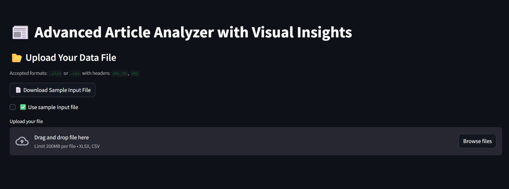
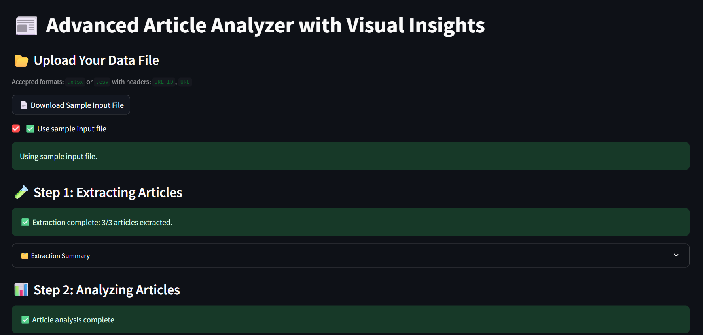
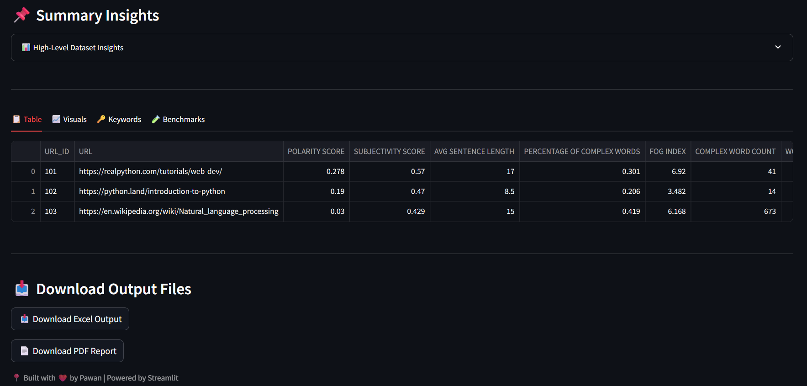
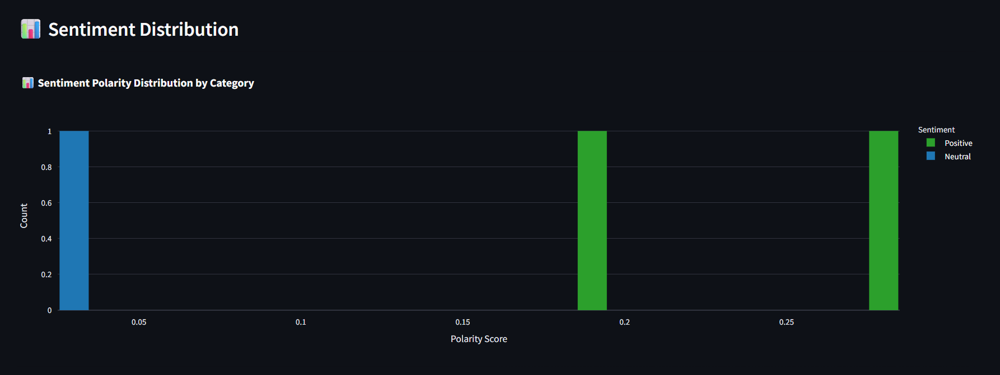
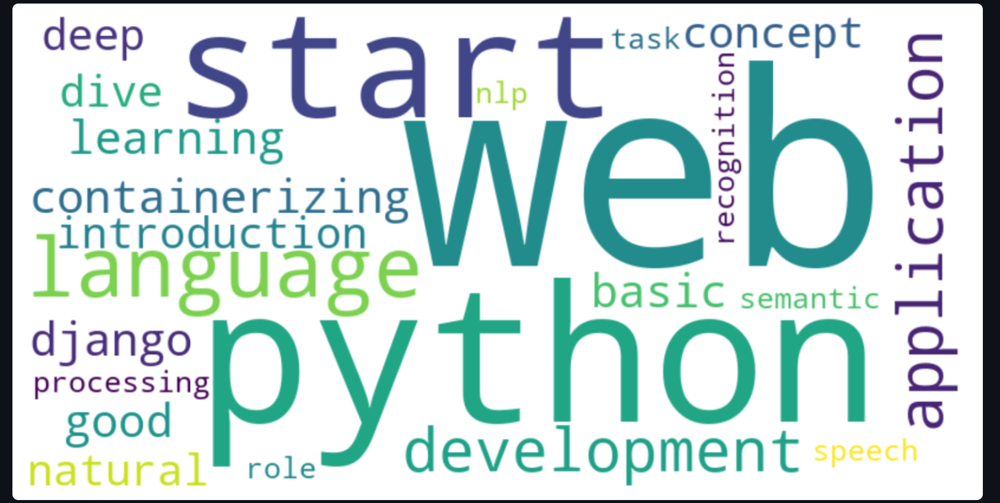
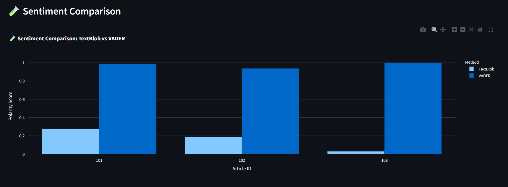

# 🧠 Article Analyzer with Visual Insights

A powerful and interactive Streamlit-based web app that analyzes articles for **sentiment**, **readability**, **keyword relevance**, and performs **benchmarking across multiple NLP tools**. Designed for students, researchers, and data enthusiasts looking to validate and visualize text insights — all in one place.

---

## 🚀 Features

### 📑 Article Analysis
- Extracts and analyzes articles from a set of input URLs
- Calculates:
  - ✅ **Sentiment Score** (TextBlob & VADER)
  - 📚 **Readability Scores** (Flesch Reading Ease & Gunning Fog)
  - 📌 **Word Count**, **Complexity**, **Personal Pronouns**
  - 🔍 **Top 5 Keywords** per article using YAKE

### 📊 Visual Insights
- Interactive visualizations using Plotly:
  - Sentiment Distribution Bar Charts
  - Word Count vs Complexity Bubble Chart
  - Personal Pronoun BarChart
  - WordCloud of Frequent Terms

### 🧪 Benchmarking Tools
- Compare performance of:
  - 📈 **TextBlob vs VADER** (ML vs Rule-based Sentiment Engines)
  - 📚 **Fog vs Flesch** (Complexity vs Ease Readability Metrics)
- Includes:
  - Sentiment score differences
  - Donut-style agreement pie charts
  - Correlation metrics

### 📦 Outputs & Downloads
- Analyze up to 20 articles
- View results in dynamic tables
- 📥 Download sentiment and readability results as `.csv`
- 📄 Generate summary PDF reports (auto-deleted after 30 mins)

---

## 🖼️ Sample Screenshots
| Home | Input Uploded | Summary |
|--------------|----------------|---------|
|  |  |  |

| Sentiment | Keyword Cloud | Benchmark |
|--------------|----------------|---------|
|  |  |  |

---

## 🛠️ Tech Stack

- `Streamlit` – for frontend & deployment
- `TextBlob`, `VADER` – for sentiment analysis
- `textstat` – for readability scoring
- `Yake` – for keyword extraction
- `Plotly` – for interactive visualizations
- `reportlab` – for PDF generation

---

## 💡 How to Use

### 1. Clone the Repo

git clone https://github.com/Pawan1006/article-analyzer-streamlit.git
cd article-analyzer-app

2. Install Dependencies
pip install -r requirements.txt

3. Run the App
streamlit run main_app.py

---

### 🧾 App Highlights

- 🤔 Why Use This App?
  - This app helps you:
  - 📈 Compare Sentiment Engines (TextBlob vs VADER)
  - 📚 Evaluate Readability (Flesch vs Fog)
  - 🧪 Understand tool agreement/disagreement
  - 🧠 Choose the right NLP tool for your project or dataset

- 🧭 What Can You Do?
  - 🔍 Analyze up to 20 articles at once
  - 📊 Visualize results in interactive graphs
  - 🧪 Benchmark ML vs Rule-based tools
  - 📥 Export results as CSV or PDF
  - 🧹 Auto-clean PDF reports after 30 mins

- 🧼 PDF Auto-Cleanup Logic
  - Each user session generates its own unique PDF report.
  - Using uuid and timestamp, each report is stored in /output/.
  - A background function deletes PDFs older than 30 minutes every time app runs (only expired ones — safe for multiple users).

- ✨ Powered By
  - 🧬 A multi-model NLP analyzer powered by rule-based, statistical, and linguistic intelligence.

---

## 📃 License
  - This project is open-source and free to use under the MIT License.

---

## 👤 Author
**Pawan Solanki**  
🎓 *B.S. in Data Science & Applications* — *IIT Madras*  
💡 Passionate about solving real-world problems with data
  
---

## ⭐ If this project helped you, consider giving it a star and sharing it with others.
